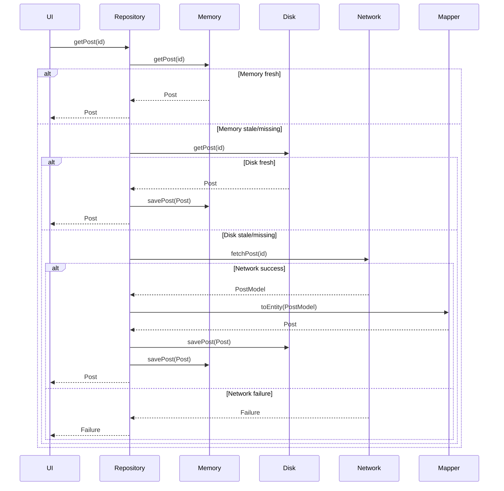

# Data Caching Flow: Dart Clean Architecture

This document describes the caching flow for network results in the codebase, inspired by the RxJava multi-source loading pattern from [Dan Lew's blog](https://blog.danlew.net/2015/06/22/loading-data-from-multiple-sources-with-rxjava/), but implemented in Dart using Clean Architecture principles.

---

## Caching Flow Overview

The repository loads data from three sources in priority order:

1. **Memory Cache**
2. **Disk Cache**
3. **Network**

Each source is checked for freshness before falling back to the next. Fresh results are propagated back up the chain.

---

## Step-by-Step Flow

### 1. Try Memory Cache
- Call `memory.getAllPosts()` or `memory.getPost(id)`.
- If data exists **and** is fresh (`isUpToDate()`):
  - Return immediately.
- Otherwise, proceed to disk.

### 2. Try Disk Cache
- Call `disk.getAllPosts()` or `disk.getPost(id)`.
- If data exists **and** is fresh (`isUpToDate()`):
  - Save to memory cache (`memory.savePost(...)`).
  - Return immediately.
- Otherwise, proceed to network.

### 3. Try Network

- Call `network.fetchAllPosts()` or `network.fetchPost(id)`.
- On success:
  - Convert network model to domain entity using `PostMapper.toEntity`.
  - Save results to disk (`disk.savePost(entity)`).
  - Save results to memory (`memory.savePost(entity)`).
  - Return network data as domain entities.
- On failure:
  - Return error.

---

## Data Freshness

- Each cache entry has a `fetchedAt` timestamp (stored as a String in DB and model).
- Freshness is determined by the `isUpToDate()` method on the domain entity.
- When reading from disk, `PostMapper.fromDb` parses the string and falls back to `DateTime.now()` if missing or malformed.

---

## Error Handling
- All operations return a `dartz.Either<Failure, Data>` type.
- Failures are propagated up the chain and returned if no source yields fresh data.

---

## Clean Architecture Principles

- **Separation of Concerns:** Data sources (memory, disk, network) are independent.
- **Repository Pattern:** The repository coordinates cache logic and exposes a unified API.
- **SOLID:** Each class has a single responsibility and dependencies are injected.
- **Mapping Layer:** All conversions between model and entity are handled by `PostMapper` for consistency and null safety.

---

## Comparison to RxJava Flow

- The Dart implementation uses async/await and functional error handling (`Either`) instead of Rx streams.
- The source priority and fallback logic directly mirror the RxJava pattern, but adapted for Dart idioms.
- The mapping layer ensures robust conversion and null safety, which is explicit in Dart.

---

## Sequence Diagram

---

## Summary

- The codebase follows the multi-source caching flow described in the referenced RxJava article, adapted for Dart and Clean Architecture.
- Data is always loaded from the fastest, freshest source available, with fallbacks and cache updates as needed.
- All model/entity conversions are handled by a dedicated mapping layer for consistency and null safety.
